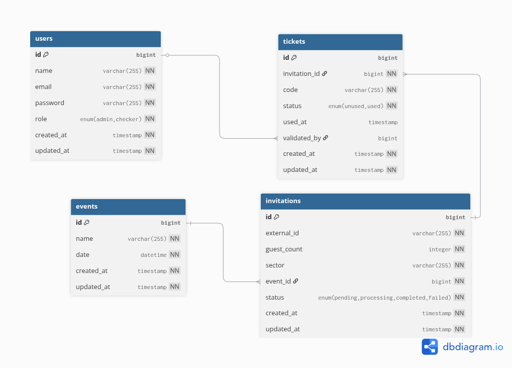

# MDS-Eventos Access Control API

REST API for managing guest access control during events with digital invitations, ticket generation, and validation.

## Table of contents

- [Overview](#overview)
- [Features](#features)
- [Database schema](#database-schema)
- [Installation](#installation)
- [API Documentation](#api-documentation)
- [Testing](#testing)
- [External API Integration](#external-api-integration)
- [Design Decisions](#design-decisions)

---

## Overview

This API was developed for **MDS-Eventos**, an event organizing company, to manage guest access control. The system integrates with an external invitation service, generates access tickets, and validates them at event checkpoints.

### Key Responsibilities

- Generate valid access tickets from external invitations
- Validate tickets at entry checkpoints
- Authenticate ticket checkers and administrators
- Provide statistics and reports for event organizers

---

## Features

### Authentication & Authorization
- **OAuth 2.0** via Laravel Passport
- **Role-based access control** (Admin, Checker)
- Token-based authentication for all protected routes

### Public Endpoints
- **Invitation redemption** - Query external API and generate tickets
- **Ticket status** - Check generated tickets for an invitation

### Checker Features
- **Ticket validation** - Mark tickets as used at event entrance

### Admin Features
- **Invitation history** - View all redeemed invitations with filters (by event, sector, date range)
- **Used tickets report** - Paginated list of validated tickets by event

### Technical Highlights
- **Asynchronous ticket generation** using Laravel Queues
- **N+1 query prevention** with eager loading
- **Service layer architecture** for business logic
- **Retry logic** for external API calls 
- **Response caching** for external API optimization

---

## Database Schema



---

## Installation

### Prerequisites

- PHP >= 8.2
- Composer
- SQLite or MySQL
- Node.js & npm (for asset compilation)

### Quick Setup

```bash
# Clone repository
git clone <repository-url>
cd moveo-challenge

# Install dependencies and setup
composer setup
```

### Manual Setup (Alternative)

```bash
composer install
cp .env.example .env
php artisan key:generate
php artisan migrate
php artisan passport:keys
php artisan passport:client --personal --name="Personal Access Client"
npm install && npm run build
```

### Environment Configuration

Update `.env` with external API credentials:

```env
INVITATION_BASE_URL="https://mds-events-main-nfwvz9.laravel.cloud/api/invitations"
INVITATION_BEARER_TOKEN="secret123"

QUEUE_CONNECTION=database  
CACHE_STORE=database
```

### Development Server

```bash
# Start all services (server, queue worker, logs)
composer dev
```

---

## API Documentation

### Base URL
```
http://127.0.0.1:8000/api
```

### Postman Collection
Import `Moveo_Challenge.postman_collection.json` for a complete API reference with examples.

### Quick Reference

#### Authentication
```bash
# Register
POST /register
Content-Type: application/json
{
  "name": "Admin User",
  "email": "admin@example.com",
  "password": "password",
  "role": "admin"
}

# Login
POST /login
Content-Type: application/json
{
  "email": "admin@example.com",
  "password": "password"
}
```

#### Public Routes
```bash
# Redeem invitation (generates tickets)
POST /invitations/{hash}/redeem

# Get invitation tickets
GET /invitations/{external_id}/tickets
```

#### Admin Routes (requires admin token)
```bash
# List invitations with filters (check available filters at Postman collection)
GET /invitations?per_page=10&page=1

# Get used tickets for event
GET /events/{eventId}/tickets/used?per_page=10&page=1
```

#### Checker Routes (requires checker token)
```bash
# Validate ticket
POST /tickets/{code}
Authorization: Bearer {token}
```

---

## Testing

### Running Tests

```bash
# Run all tests
composer test
```

---

## External API Integration

The system integrates with the MDS-Eventos invitation service:

**Endpoint:** `GET https://mds-events-main-nfwvz9.laravel.cloud/api/invitations/{hash}`  
**Auth:** `Bearer secret123`

---

## Design Decisions

### Async Ticket Generation

**Problem:** Generating 100+ tickets blocks the redemption request.

**Solution:** 
- Immediate 201 response after creating invitation
- `GenerateInvitationTickets` job dispatched to queue
- Client polls `/invitations/{hash}/tickets` to check progress

### Service Layer

**Problem:** Controllers become bloated with business logic.

**Solution:**
- Thin controllers delegate to services
- Services contain all business logic
- Easy to test, reuse, and maintain

### Query Objects

**Problem:** Complex filtering logic in controllers/models.

**Solution:**
- `InvitationSearchQuery` encapsulates filter logic
- Reusable across endpoints
- Testable in isolation

---

## Additional Documentation
- See `AGENTS.md` (for AI coding assistants)
---
